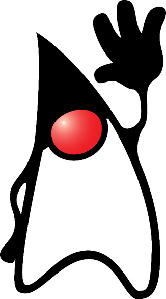
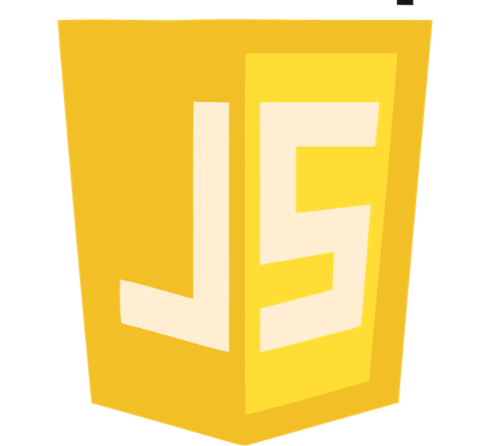
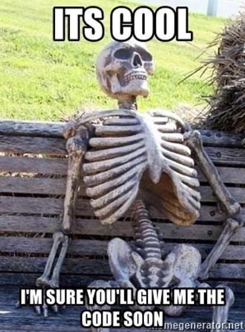

import { Appear, Image } from "mdx-deck";
import { hack as theme } from "mdx-deck/themes";
import { Box, Flex } from "rebass";

import SvgArrow from "./components/SvgArrow";
import SvgBox from "./components/SvgBox";
import Step from "./components/Step";
import WebView from "./components/WebView";

export { theme };

<Box style={{ textAlign: "right" }}>
    <h3>Mateusz Lewandowski</h3>
</Box>

<Appear>
    <h1>~9 lat doświadczenia</h1>
    <Flex flexWrap="wrap" alignItems="center">
        <Box style={{ textAlign: "center" }} width={1 / 3}>
            Java
        </Box>
        <Box style={{ textAlign: "center" }} width={1 / 3}>
            JavaScript
        </Box>
        <Box style={{ textAlign: "center" }} width={1 / 3}>
            PHP
        </Box>
        <Box style={{ textAlign: "center" }} width={1 / 3}>
            C#
        </Box>
        <Box style={{ textAlign: "center" }} width={1 / 3}>
            C/C++
        </Box>
        <Box style={{ textAlign: "center" }} width={1 / 3}>
            Haskel
        </Box>
    </Flex>
</Appear>

```notes
dużo języków
```

---

<div style={{ position: "relative" }}>
    <Appear>
        
        
        
        
        
    </Appear>
</div>

---

# How to embed JS UI in Java client application

### JS <-> Java communication

```notes

```

---

<React.Fragment>
    <Image src="./resources/black-hole.jpg" />
    <Flex
        alignItems="center"
        justifyContent="space-between"
        style={{ position: "absolute", top: 0, width: "100%", height: "100%" }}
    >
        <Box m="10%">
            
        </Box>
        <Box m="10%">
            
        </Box>
    </Flex>
</React.Fragment>

```notes
Jak tak naprawdę połączyć dwa światy?
```

---

# Mój obecny projekt

<Flex flexWrap="wrap" alignItems="center" style={{ maxWidth: 1050 }}>
    <Appear>
        <Box width={1 / 2}>Java 6</Box>
        <Box width={1 / 2}>Monolit</Box>
        <Box width={1 / 2}>Swing</Box>
        <Box width={1 / 2}>RMI</Box>
        <Box width={1}>Logika biznesowa pomieszana z warstwą widoku</Box>
        <Box width={1}>Jak i z wywołaniami RMI</Box>
    </Appear>
</Flex>

```notes
Aplikacja kliencka
UI w swingu
komunikacja po RMI
duuuużo kodu

prowadzący na studiach twierdził że Java się nie nadaje do aplikacji klienckich aż do...
```

---

<WebView />

```notes
można było wreszcie w "Javowej" aplikacji pisać normalne UI

tylko u nas mieliśmy już sporo logiki w Javie
tego się nie da tak po prostu przepisać
tym bardziej że nie mamy normalnego API na serwerze
```

---

# SPA w WebView

<ul>
    <Appear>
        <li>logika zostaje w Javie (na razie)</li>
        <li>za prezentacje odpowiada SPA wyświetlana w WebView</li>
    </Appear>
</ul>

```notes
Dla tego wymyśliliśmy podejście hybrydowe
zostawimy w Javie to co ma sens w javie - logikę biznesową
widok idzie do JSa (Single page application)
```

---

# Stopniowa migracja

```notes
To dało możliwość refactoringu po kolei
ale wprowadziło dodatkowy problem...
jak synchronizować stan (bo niestety cała aplikacja kliencka chciał nie chiał jest stanowa)
```

---

# SPA musi być bezstanowa

<Appear>
    <small>na tyle, na ile się da...</small>
</Appear>

```notes
rozwiązanie - nie synchronizować
stan ma być po stronie javy - tylko

no, na tyle na ile się da
```

---

# Event driven

<svg
    version="1.1"
    xmlns="http://www.w3.org/2000/svg"
    width="100%"
    viewBox="0 0 700 250"
>
    <g transform="translate(0, 50)">
        <Step step={1}>
            <g>
                <SvgBox y="0" w="240" h="200">
                    Java Model
                </SvgBox>
                <SvgBox x="460" y="0" w="240" h="200">
                    JS View
                </SvgBox>
            </g>
        </Step>
        <Step step={2}>
            <SvgArrow path="M240,50, L460,50" x={(460 - 240) / 2 + 240} y="30">
                view state
            </SvgArrow>
        </Step>
        <Step step={3}>
            <SvgArrow
                path="M460,150, L240,150"
                x={(460 - 240) / 2 + 240}
                y="170"
            >
                action
            </SvgArrow>
        </Step>
        <Step step={4} exact={true}>
            <image
                href="./resources/redux.png"
                width="250"
                height="250"
                x={(700 - 250) / 2}
                y="-50"
            />
        </Step>
    </g>
</svg>

```notes
Mamy na szczęście w programowaniu obiektowym coś co się nazwywa "message driven architecture"

takie musi być połączenie pomiędzy UI a logiką biznesową - u nas to oznacza refactoring

model jest odpowiedzialny za udostępnienie obiektu (idealnie niemutowalnego) ze stanem
widok na podstawie tylko i wyłącznie aktualnego stanu wyświetla UI

interakcje z UI powodują tworzenie obiektów-akcji (również niemutowalnych) które są wysyłane do modelu

do tego idelnie nadaje się biblioteka RxJava
```

---


```notes
RxJava ma swój odpowiednik/pierwowzór w RxJs

możemy więc używać "tej samej" biblioteki po obu stronach - w Javie i w JS

to teraz info - jak
idziemy do kodu
```

---

# Event driven

<svg
    version="1.1"
    xmlns="http://www.w3.org/2000/svg"
    width="100%"
    viewBox="0 0 700 250"
>
    <g transform="translate(0, 50)">
        <g>
            <SvgBox y="0" w="240" h="200">
                Java Model
            </SvgBox>
            <SvgBox x="460" y="0" w="240" h="200">
                JS View
            </SvgBox>
        </g>
        <SvgArrow path="M240,50, L460,50" x={(460 - 240) / 2 + 240} y="30">
            view state
        </SvgArrow>
        <SvgArrow path="M460,150, L240,150" x={(460 - 240) / 2 + 240} y="170">
            action
        </SvgArrow>
    </g>
</svg>

---



---

## Problemy

<ul>
    <Appear>
        <li>routing</li>
        <li>multithreading</li>
        <li>synchronizacja stanu</li>
        <li>message driven</li>
    </Appear>
</ul>

```notes
nie jest to droga bez problemów

w javie porzełączanie się pomiędzy ekranami jest imperatywne i zawsze takie będzie, w js deklaratywne
utrudnia to stopniowy refactoring

mutithreading - przeglądarka to osobny proces

bezstanowość w JS, message driven - czasami nie da się tego w 100% osiągnąć (niedostateczny refactoring) - wtedy dzieją się nieprzyjemne żeczy
```

---

# Q&A

---

# Dziękuję za uwagę
